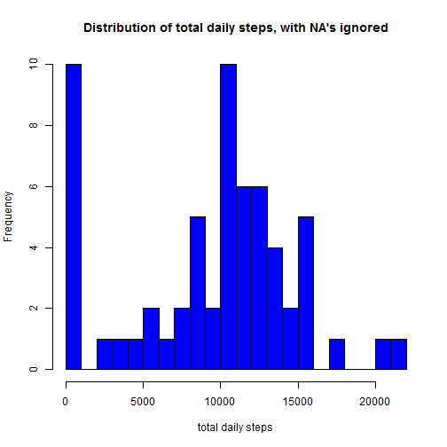
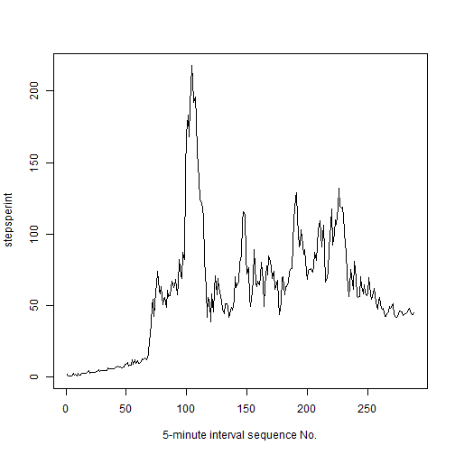
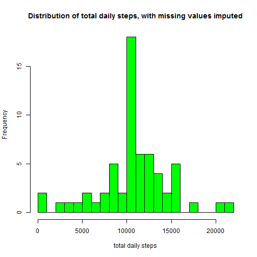
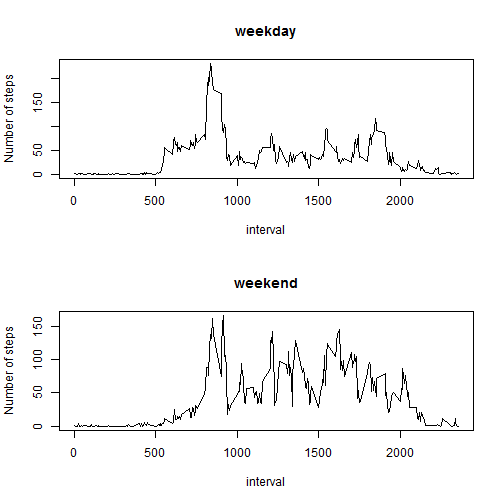

Week 1 Assignment, Reproducible Research course
===============================================

Loading data and packages:

```r
library(tidyr)
library(chron)
library(dplyr)
rr <- read.csv("./activity.csv")
```


Process/transform the data (if necessary) into a format suitable for the analysis


```r
rr_bydate <- spread(rr, date, steps)
```

mean total number of steps taken per day


```r
stepsperday <- colSums(rr_bydate[, -1], na.rm = TRUE)
```

Making a histogram of the total number of steps taken each day


```r
hist(x=stepsperday, col = "blue", breaks=20,
     xlab = "total daily steps",
     main = "Distribution of total daily steps, with NA's ignored" )
```



Calculation and report of the mean and median of the total number of steps taken per day


```r
mn_spd <- mean(stepsperday)
md_spd <- median(stepsperday)
mn_sentence <- c("The mean is", mn_spd)
md_sentence <- c("The median is", md_spd)
print(mn_sentence, quote = FALSE)
```

```
## [1] The mean is      9354.22950819672
```

```r
print(md_sentence, quote = FALSE)
```

```
## [1] The median is 10395
```

the average daily activity pattern
==================================

the average number of steps taken per 5-minute interval, averaged across all days


```r
stepsperint <- rowMeans(rr_bydate, na.rm = TRUE)
plot(stepsperint, type = "l", xlab = "5-minute interval sequence No.")
```



5-minute interval that on average across all the days in the 
dataset, contains the maximum number of steps


```r
maxint <- stepsperint[which(stepsperint == max(stepsperint))]
df_maxint <- data.frame(maxint)
specint <- row.names(df_maxint)
specinn <- as.numeric(specint)
maxteps_sentence <- c("Maximum number of steps has the interval No.", specinn)
print(maxteps_sentence, quote = FALSE)
```

```
## [1] Maximum number of steps has the interval No.
## [2] 104
```

Imputing missing values
======================

Calculate and report the total number of rows with NAs


```r
obs_w_nas <- sum(!complete.cases(rr))
obn_sentence <- c("The total number of observations with NAs is", obs_w_nas)
print(obn_sentence, quote = FALSE)
```

```
## [1] The total number of observations with NAs is
## [2] 2304
```

The missing values are filled with the mean value of the respective
5-minute interval across all days.

In the code it is assumed that all dates with NA values have all of their 
interval values = NA.


```r
rr_bydate_new <- rr_bydate
for (i in 2:62) {
      if (sum(is.na(rr_bydate[, i]) > 0)) {
           rr_bydate_new[, i] <- rowMeans(rr_bydate[, -1], na.rm = TRUE)
      }
}

stepsperday_new <- colSums(rr_bydate_new[, -1], na.rm = TRUE)
hist(x = stepsperday_new, col = "green", breaks = 20,
     xlab = "total daily steps",
     main = "Distribution of total daily steps, with missing values imputed")
```



Calculation and report of the mean and median of the total number of steps taken per day
on a dataset with missing data filled in


```r
mn_spd_new <- mean(stepsperday_new)
md_spd_new <- median(stepsperday_new)
mn_sentence_new <- c("The new mean is", mn_spd_new)
md_sentence_new <- c("The new median is", md_spd_new)
print(mn_sentence_new, quote = FALSE)
```

```
## [1] The new mean is  10766.1886792453
```

```r
print(md_sentence_new, quote = FALSE)
```

```
## [1] The new median is 10766.1886792453
```

The new mean of steps per day is bigger for the filled in values

The new median is the value in the middle that shows up several times,
so it equals to the new mean from obvious reasons

In the new histogram there is obvious decrease in the number of days with 
smallest number of steps and increase to the number of days with medium 
number of steps.

differences in activity patterns between weekdays and weekends
=============================================================

determining which dates are weekdays/weekends


```r
cn <- colnames(rr_bydate_new)
cnf <- cn[-1]
cl <- as.Date(cnf)
cfin <- is.weekend(cl)    # library(chron)
cfin_mod <- c(NA, cfin)
```


separation of weekdays and weekends into 2 data frames


```r
rr_weekday <- rr_bydate_new
rr_weekend <- rr_bydate_new
for (i in 2:62) {
  if (cfin_mod[i]==TRUE)
    rr_weekday[1,i] <- NA
  else
    rr_weekend[1, i] <- NA
}
rr_weekday <- rr_weekday[, colSums(is.na(rr_weekday)) == 0]
rr_weekend <- rr_weekend[, colSums(is.na(rr_weekend)) == 0]
```

calculation of average number of steps per interval 
for both weekdays and weekends


```r
plot_wday <- rowMeans(rr_weekday[, -1])
plot_wend <- rowMeans(rr_weekend[, -1])
```

reshaping into a format suitable for plotting


```r
pdf_wday <- data.frame(plot_wday)
pdf_wend <- data.frame(plot_wend)
pdf_wday$interval <- rr_bydate$interval
pdf_wend$interval <- rr_bydate$interval
pdf_wday <- select(pdf_wday, interval, plot_wday) #library(dplyr)
pdf_wend <- select(pdf_wend, interval, plot_wend)
```


plot


```r
#dev.off()
par(mfrow=c(2,1))

plot(pdf_wday, main = "weekday", type = "l", ylab="Number of steps")
plot(pdf_wend, main = "weekend", type = "l", ylab="Number of steps")
```


